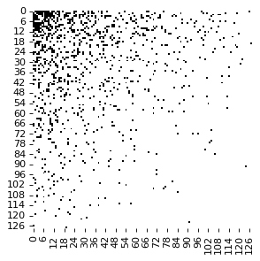
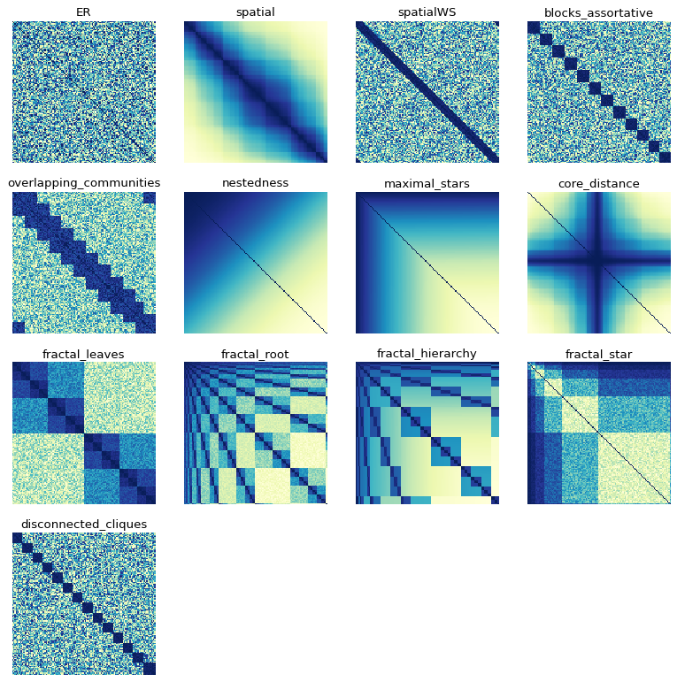
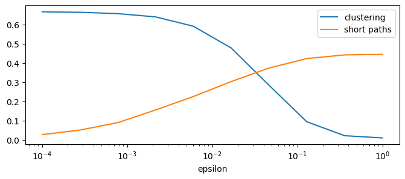
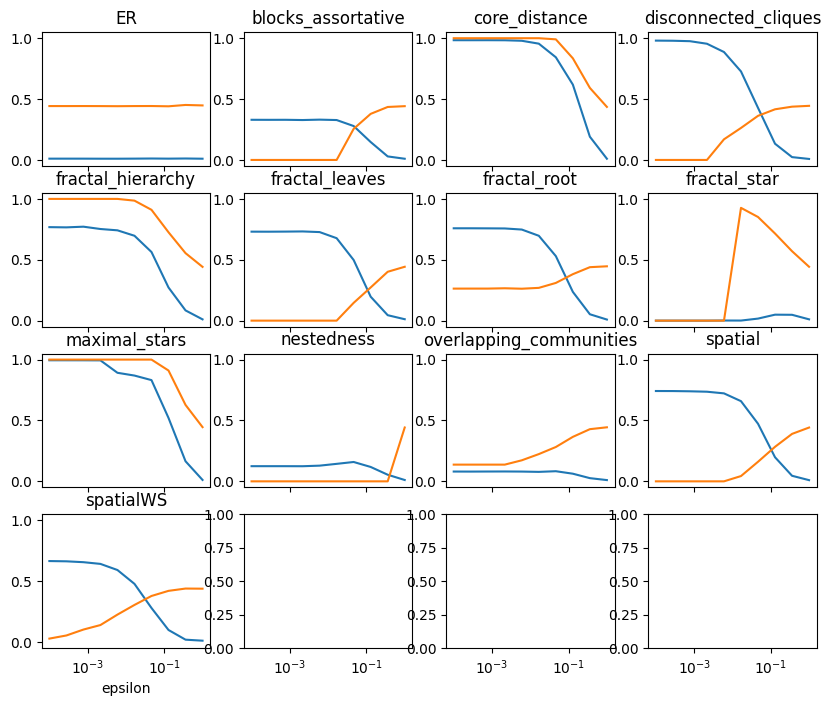
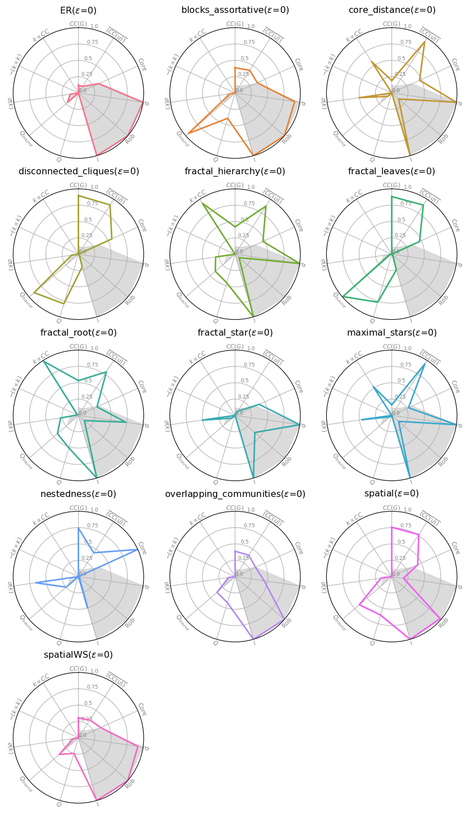
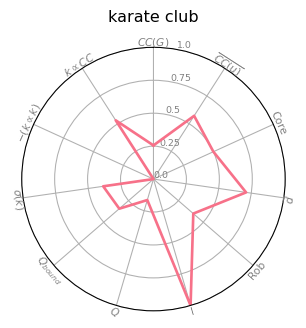
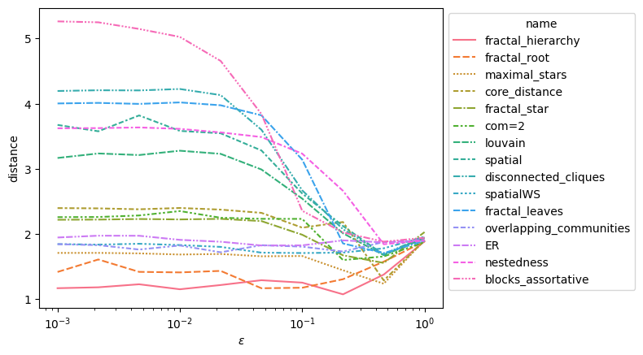
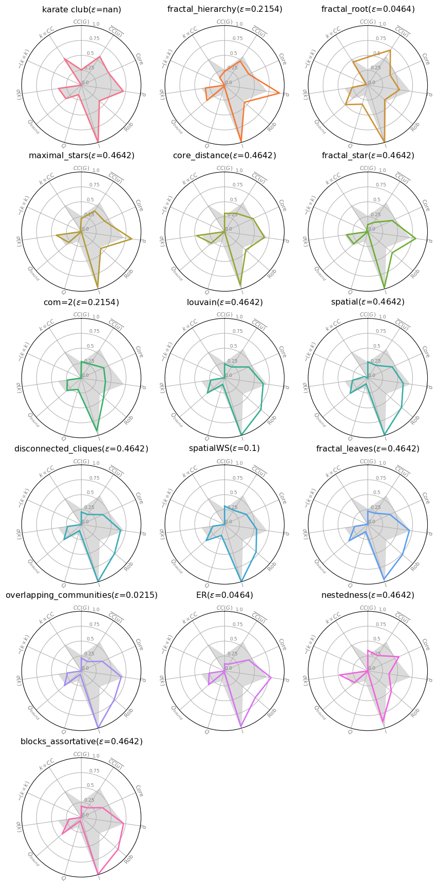

.. code:: ipython3

    %load_ext autoreload
    %autoreload 2
    import networkx as nx
    import itertools
    import numpy as np
    import pandas as pd
    import matplotlib.pyplot as plt
    from matplotlib.pyplot import figure
    import netwulf
    import seaborn as sns
    
    import structify_net as stn
    import structify_net.viz as viz
    import structify_net.zoo as zoo
    import structify_net.scoring as scoring

Introduction to Structify-Net
=============================

Structify-Net is a network generator provided as a python library.

It allows to generate networks with: \* A chosen number of nodes and
edges \* A chosen structure \* A constrolled amount of randomness

Step 1: Graph properties definition
-----------------------------------

We start by defining the number of nodes and edges that we want

.. code:: ipython3

    n=128
    m=512

Step 2: Structure definion
--------------------------

We start by defining a structure, by ordering the pairs of nodes in the
graph from the most likely to appear to the less likely to appear. For
instance, if we assume that our network is a spatial network, and that
each node has a position in an euclidean space, we can define that the
pairs of nodes are ranked according to their distance in this space.

Many classic structures are already implemented in Structify-Net, you
can check them in section SSS. For the sake of example, here we define a
very simple organisation, which actually correspond to a nested
structure

.. code:: ipython3

    # This function takes as input a number of nodes, and return a
    def sort_nestedness(nodes=10):
        nodes= list(range(nodes))
        sorted_pairs=itertools.combinations(nodes,2)
        #Node pairs are ranked according to the sum of the id of the nodes. 
        sorted_pairs = sorted(list(sorted_pairs),key=lambda x: x[0]+x[1])
        return stn.Rank_model(sorted_pairs)

A way to visualize the resulting structure is to plot the node pairs
order as a matrix

.. code:: ipython3

    figure(figsize=(4, 4), dpi=80)
    sort_nestedness(n).plot_matrix()

.. image:: output_7_0.png

Step 3: Edge probability definition
-----------------------------------

Now that we know which node pairs are the most likely to appear, we need
to define a function :math:`f` that assign edge probabilities on each
node pair, by respecting some constraints: \* The expected number of
edges must be equal to the chosen parameter ``m``,
i.e. :math:`\sum_{u,v\in G}f(rank(u,v))=m` \* For any two node pairs
:math:`e_1` and :math:`e_2`, if :math:`rank(e_1)>rank(e_2)`, then
:math:`f(e_1)\geq f(e_2)`

Although any such function can be provided, Structify-net provides a
convenient function generator, using a constraint parameter
:math:`\epsilon \in [0,1]`, such as 0 corresponds to a deterministic
structure, the m pairs of highest rank being connected by an edge, while
1 corresponds to a fully random network.

.. code:: ipython3

    probas = sort_nestedness(n).get_generator(epsilon=0.5,m=m)

We can plot the probability as a function of rank for various values of
``epsilon``

.. code:: ipython3

    fig, ax = plt.subplots()
    for epsilon in np.arange(0,1.1,1/6):
        probas = stn.sort_nestedness(n).get_generator(epsilon=epsilon,m=m)
        elt = probas.plot_proba_function(ax=ax)
        #elt=viz.plot_proba_function(probas,ax=ax)
        elt[-1].set_label(format(epsilon, '.2f'))
        #fig_tem.plot(label="pouet"+str(epsilon))
    ax.legend(title="$\epsilon$")

.. parsed-literal::

    <matplotlib.legend.Legend at 0x1489190d0>

.. image:: output_11_1.png

Step 4: Generate a graph from edge probabilities
------------------------------------------------

.. code:: ipython3

    generator = stn.sort_nestedness(n).get_generator(epsilon=0.5,m=m)
    g_generated = generator.generate()

.. code:: ipython3

    figure(figsize=(4, 4), dpi=80)
    viz.plot_adjacency_matrix(g_generated)

.. parsed-literal::

    <AxesSubplot: >

Whole process in a function
---------------------------

The whole process of graph generation from a desired number of nodes and
edges can be done in a single function

.. code:: ipython3

    g_example = sort_nestedness(n).generate_graph(epsilon=0,m=500)

Structure Zoo
-------------

StructifyNet already implement various graph structure. They are
exemplified below

.. code:: ipython3

    n=128
    m=512
    figure(figsize=(12, 12), dpi=80)
    for i,(name,rank_model) in enumerate(zoo.get_all_rank_models(n=128,m=m).items()):
        ax = plt.subplot(4,4,i+1 )
        
        rank_model.plot_matrix()
        
        ax.set_title(name)

Graph description
-----------------

Models generate graphs having specific properties. Structify-Net
includes various scores that can be used to characterize networks –and
the model generating them.

Getting Started: replicating Watts-Strogatz Small World experiment
~~~~~~~~~~~~~~~~~~~~~~~~~~~~~~~~~~~~~~~~~~~~~~~~~~~~~~~~~~~~~~~~~~

The famous small world experiments consisted in generating networks with
a locally clustered structure (nodes are located on a ring and connected
to their neighbors), and then introducing progressively random noise,
until reaching a random network. The *small world regime* corresponds to
the level of noise for which the clustering coefficient is still high
-as in the locally clustered network- but the average shortest path is
already low -as in a random network.

.. code:: ipython3

    n=1000
    m=n*5
    WS_model = zoo.sort_spatial_WS(n,k=10) #k is the nodes degree
    df_scores = WS_model.scores(m=m,
                    scores={"clustering":scoring.average_clustering,
                            "short paths":scoring.average_shortest_path_length},
                    epsilons=np.logspace(-4,0,10))
    df_scores.head(3)

.. raw:: html

    

    
    <table border="1" class="dataframe">
      <thead>
        <tr style="text-align: right;">
          <th></th>
          <th>name</th>
          <th>clustering</th>
          <th>short paths</th>
          <th>epsilon</th>
        </tr>
      </thead>
      <tbody>
        <tr>
          <th>0</th>
          <td>model</td>
          <td>0.666080</td>
          <td>0.026688</td>
          <td>0.000100</td>
        </tr>
        <tr>
          <th>1</th>
          <td>model</td>
          <td>0.663433</td>
          <td>0.050277</td>
          <td>0.000278</td>
        </tr>
        <tr>
          <th>2</th>
          <td>model</td>
          <td>0.656545</td>
          <td>0.088951</td>
          <td>0.000774</td>
        </tr>
      </tbody>
    </table>
    

Plotting the results
~~~~~~~~~~~~~~~~~~~~

We can observe the small world regime by plotting the evolution of both
values as a function of ``epsilon``. Note that the ``short paths`` is
defined in a different way than in the original article, to be more
generic. It corresponds to the inverse of the average distance,
normalized such as ``short paths``\ =1 for a network with a complete
star, such as each node is at distance 2 from all other node.

.. code:: ipython3

    df_scores.plot(x="epsilon",logx=True,figsize=(8, 3))

.. parsed-literal::

    <AxesSubplot: xlabel='epsilon'>

Small World regime for other structures
~~~~~~~~~~~~~~~~~~~~~~~~~~~~~~~~~~~~~~~

We can replicate this experiment for all structures in our structure zoo

.. code:: ipython3

    df_scores = scoring.scores_for_rank_models(zoo.get_all_rank_models(n,m),m=m,
                           scores={"clustering":scoring.average_clustering,
                                   "short paths":scoring.average_shortest_path_length},
                           epsilons=np.logspace(-4,0,10))                  

.. code:: ipython3

    df_scores.head()

.. raw:: html

    

    
    <table border="1" class="dataframe">
      <thead>
        <tr style="text-align: right;">
          <th></th>
          <th>name</th>
          <th>clustering</th>
          <th>short paths</th>
          <th>epsilon</th>
        </tr>
      </thead>
      <tbody>
        <tr>
          <th>0</th>
          <td>ER</td>
          <td>0.010597</td>
          <td>0.442601</td>
          <td>0.0001</td>
        </tr>
        <tr>
          <th>1</th>
          <td>blocks_assortative</td>
          <td>0.329862</td>
          <td>0.000000</td>
          <td>0.0001</td>
        </tr>
        <tr>
          <th>2</th>
          <td>core_distance</td>
          <td>0.983615</td>
          <td>1.000000</td>
          <td>0.0001</td>
        </tr>
        <tr>
          <th>3</th>
          <td>disconnected_cliques</td>
          <td>0.980277</td>
          <td>0.000000</td>
          <td>0.0001</td>
        </tr>
        <tr>
          <th>4</th>
          <td>fractal_hierarchy</td>
          <td>0.768027</td>
          <td>1.000000</td>
          <td>0.0001</td>
        </tr>
      </tbody>
    </table>
    

.. code:: ipython3

    g = df_scores.groupby('name')
    
    fig, axes = plt.subplots(4,4, sharex=True)
    all_axes = axes.flatten()
    for i, (name, d) in enumerate(g):
        ax = d.plot.line(x='epsilon', ax=all_axes[i], title=name,logx=True,figsize=(10, 8))
        ax.set_ylim(-0.05,1.05)
        ax.legend().remove()

Models Profiling
----------------

Average distance and Average clustering are only two examples of graph
structure descriptors. Structify-Net contains several other descriptors.
We can use them to show more details of the evolution from the regular
grid to the random network

.. code:: ipython3

    detail_evolution = zoo.sort_spatial_WS(500).scores(m=500*5,epsilons=np.logspace(-4,0,6),scores=scoring.get_default_scores(),latex_names=True)
    #detail_evolution = toolBox.scores_for_rank_functions({"spatialWS":zoo.sort_spatial_WS},500,500*5,epsilons=np.logspace(-4,0,6),scores=toolBox.get_all_scores())

.. code:: ipython3

    detail_evolution

.. raw:: html

    

    
    <table border="1" class="dataframe">
      <thead>
        <tr style="text-align: right;">
          <th></th>
          <th>name</th>
          <th>$CC(G)$</th>
          <th>$\overline{(CC(u))}$</th>
          <th>Core</th>
          <th>$\overline{d}$</th>
          <th>Rob</th>
          <th>I</th>
          <th>$Q$</th>
          <th>$Q_{bound}$</th>
          <th>$\sigma(k)$</th>
          <th>$$-(k \propto k)$$</th>
          <th>$${k \propto CC}$$</th>
          <th>$\epsilon$</th>
        </tr>
      </thead>
      <tbody>
        <tr>
          <th>0</th>
          <td>model</td>
          <td>0.666075</td>
          <td>0.666182</td>
          <td>0.200000</td>
          <td>0.052702</td>
          <td>1.00</td>
          <td>1.0</td>
          <td>0.777650</td>
          <td>0.225802</td>
          <td>0.000398</td>
          <td>0.0</td>
          <td>0.0</td>
          <td>0.000100</td>
        </tr>
        <tr>
          <th>1</th>
          <td>model</td>
          <td>0.658702</td>
          <td>0.660061</td>
          <td>0.180000</td>
          <td>0.128084</td>
          <td>0.98</td>
          <td>1.0</td>
          <td>0.774826</td>
          <td>0.225668</td>
          <td>0.007318</td>
          <td>0.0</td>
          <td>0.0</td>
          <td>0.000631</td>
        </tr>
        <tr>
          <th>2</th>
          <td>model</td>
          <td>0.627496</td>
          <td>0.632591</td>
          <td>0.160000</td>
          <td>0.209159</td>
          <td>0.98</td>
          <td>1.0</td>
          <td>0.759227</td>
          <td>0.240701</td>
          <td>0.026304</td>
          <td>0.0</td>
          <td>0.0</td>
          <td>0.003981</td>
        </tr>
        <tr>
          <th>3</th>
          <td>model</td>
          <td>0.463373</td>
          <td>0.481762</td>
          <td>0.140000</td>
          <td>0.360342</td>
          <td>0.98</td>
          <td>1.0</td>
          <td>0.655072</td>
          <td>0.235776</td>
          <td>0.076439</td>
          <td>0.0</td>
          <td>0.0</td>
          <td>0.025119</td>
        </tr>
        <tr>
          <th>4</th>
          <td>model</td>
          <td>0.106766</td>
          <td>0.120491</td>
          <td>0.142857</td>
          <td>0.484737</td>
          <td>0.98</td>
          <td>1.0</td>
          <td>0.256430</td>
          <td>0.152290</td>
          <td>0.150846</td>
          <td>0.0</td>
          <td>0.0</td>
          <td>0.158489</td>
        </tr>
        <tr>
          <th>5</th>
          <td>model</td>
          <td>0.019009</td>
          <td>0.020193</td>
          <td>0.140000</td>
          <td>0.515918</td>
          <td>0.98</td>
          <td>1.0</td>
          <td>0.000000</td>
          <td>0.071727</td>
          <td>0.174057</td>
          <td>0.0</td>
          <td>0.0</td>
          <td>1.000000</td>
        </tr>
      </tbody>
    </table>
    

.. code:: ipython3

    viz.spider_plot(detail_evolution,reference=0)

.. image:: output_31_0.png

We can also compare properties of a set of models
~~~~~~~~~~~~~~~~~~~~~~~~~~~~~~~~~~~~~~~~~~~~~~~~~

In this case, we plot all models in Structify’s Zoo, with
``epsilon``\ =0

.. code:: ipython3

    n,m=128,128*8
    detail_evolution = scoring.scores_for_rank_models(zoo.get_all_rank_models(n,m),m,epsilons=0,latex_names=True)

.. code:: ipython3

    viz.spider_plot(detail_evolution,reference=0)

Comparing with an observed network
----------------------------------

If we are interested in a particular network, we can compare the
structure of that network with the strucuture of some candidate models
in our strucuture zoo. For instance, let us check the structure of the
Zackary karate club graph

.. code:: ipython3

    karate_scores = scoring.scores_for_graphs({"karate club":nx.karate_club_graph()},latex_names=True)
    viz.spider_plot(karate_scores)

Generate graphs of the same size
~~~~~~~~~~~~~~~~~~~~~~~~~~~~~~~~

We generate graphs using the structures in the zoo, varying the epsilon
parameter, but keeping the same number of nodes and (expected) edges
than in the target graph. To get more reliable results, we take the
average values over multiple runs.

Since the karate club graph is often interpreted in term of communities,
we include two additional versions of the structures, that can be
parameterized with the number of blocks.

.. code:: ipython3

    n=nx.karate_club_graph().number_of_nodes()
    m=nx.karate_club_graph().number_of_edges()
    models_to_compare=zoo.get_all_rank_models(n,m)
    
    louvain_communities=nx.community.louvain_communities(nx.karate_club_graph())
    models_to_compare["louvain"]=zoo.sort_blocks_assortative(n,blocks=louvain_communities)
    models_to_compare["com=2"]=zoo.sort_blocks_assortative(n,blocks=2)
    epsilons=np.logspace(-3,0,10)

.. code:: ipython3

    compare_scores = scoring.scores_for_rank_models(models_to_compare,m,epsilons=epsilons,runs=20)

.. parsed-literal::

                                                                     

Comparing
^^^^^^^^^

We compute the :math:`L_1` distance (sum of differences in each score)
between the observed graph and the models. We can explore how the
models’ similarity evolve as a function of the random parameter

.. code:: ipython3

    compare = scoring.compare_graphs(karate_scores,compare_scores,best_by_name=False,score_difference=True)

.. code:: ipython3

    ax = sns.lineplot(data=compare,x="$\epsilon$",y="distance",hue="name",style="name",palette=sns.color_palette("husl", len(models_to_compare)))
    sns.move_legend(ax, "upper left", bbox_to_anchor=(1, 1))
    plt.xscale('log')

Details of models matching
--------------------------

We can study in more details what properties does each model captures or
not. We select for each model the value of epsilon giving the best
match. Models are also sorted according the distance, so that the first
models returned are the most similar, and then we plot the properties of
those selected models, with the properties of our graph for comparison

.. code:: ipython3

    compare = scoring.compare_graphs(karate_scores,compare_scores,best_by_name=True,score_difference=False)

.. code:: ipython3

    compare.head()

.. raw:: html

    

    
    <table border="1" class="dataframe">
      <thead>
        <tr style="text-align: right;">
          <th></th>
          <th>name</th>
          <th>$CC(G)$</th>
          <th>$\overline{CC(u)}$</th>
          <th>Core</th>
          <th>$\overline{d}$</th>
          <th>Rob</th>
          <th>I</th>
          <th>$Q$</th>
          <th>$Q_{bound}$</th>
          <th>$\sigma(k)$</th>
          <th>$$-(k \propto k)$$</th>
          <th>$${k \propto CC}$$</th>
          <th>$\epsilon$</th>
          <th>distance</th>
        </tr>
      </thead>
      <tbody>
        <tr>
          <th>0</th>
          <td>fractal_hierarchy</td>
          <td>0.230491</td>
          <td>0.481793</td>
          <td>0.445833</td>
          <td>0.929937</td>
          <td>0.437</td>
          <td>0.985294</td>
          <td>0.018285</td>
          <td>0.392298</td>
          <td>0.323003</td>
          <td>0.000000</td>
          <td>0.152576</td>
          <td>0.215443</td>
          <td>1.076460</td>
        </tr>
        <tr>
          <th>1</th>
          <td>fractal_root</td>
          <td>0.469879</td>
          <td>0.698111</td>
          <td>0.410417</td>
          <td>0.536371</td>
          <td>0.374</td>
          <td>1.000000</td>
          <td>0.331491</td>
          <td>0.496156</td>
          <td>0.265743</td>
          <td>0.030529</td>
          <td>0.460243</td>
          <td>0.046416</td>
          <td>1.169814</td>
        </tr>
        <tr>
          <th>2</th>
          <td>maximal_stars</td>
          <td>0.219264</td>
          <td>0.412788</td>
          <td>0.427083</td>
          <td>0.854133</td>
          <td>0.430</td>
          <td>0.969118</td>
          <td>0.000000</td>
          <td>0.277663</td>
          <td>0.423810</td>
          <td>0.000000</td>
          <td>0.032069</td>
          <td>0.464159</td>
          <td>1.239858</td>
        </tr>
        <tr>
          <th>3</th>
          <td>core_distance</td>
          <td>0.306555</td>
          <td>0.364385</td>
          <td>0.525298</td>
          <td>0.674693</td>
          <td>0.470</td>
          <td>0.932353</td>
          <td>0.000000</td>
          <td>0.293278</td>
          <td>0.473840</td>
          <td>0.000000</td>
          <td>0.000851</td>
          <td>0.464159</td>
          <td>1.288921</td>
        </tr>
        <tr>
          <th>4</th>
          <td>fractal_star</td>
          <td>0.116625</td>
          <td>0.184110</td>
          <td>0.447222</td>
          <td>0.810483</td>
          <td>0.540</td>
          <td>0.979412</td>
          <td>0.000000</td>
          <td>0.312917</td>
          <td>0.357859</td>
          <td>0.000000</td>
          <td>0.035023</td>
          <td>0.464159</td>
          <td>1.557953</td>
        </tr>
      </tbody>
    </table>
    

.. code:: ipython3

    compare_plot=compare.drop(columns=["distance"])
    compare_plot.loc[-1, :] = karate_scores.iloc[0]
    compare_plot.sort_index(inplace=True) 

.. code:: ipython3

    viz.spider_plot(compare_plot,reference=0)

